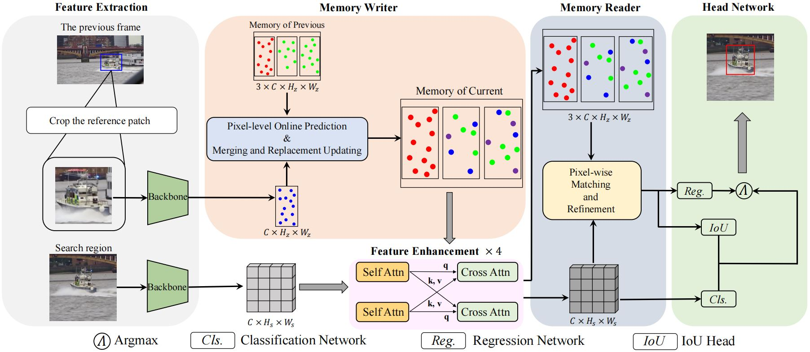

# Pixel-level Spatio-Temporal Memory

This repository is a temporary implementation of the paper [Memory Network with Pixel-level Spatio-Temporal Learning for Visual Object Tracking].

The code will release soon after the acceptance of paper.

## Introduction

**Abstract.** Making full use of temporal and spatial information is critical to cope with appearance changes of objects in visual object tracking. However, existing methods in the tracking field, which employ a memory network at frame level to learn these information, bring redundancy and cannot build long-term relationships among historical frames due to the limited memory size. In this paper, we propose a novel memory network, Pixel-level Spatio-Temporal Memory (PSTM), which organizes object features in an efficient way to leverage temporal and spatial context information. Specifically, PSTM is constructed and updated by a memory writer, which includes a pixel-level updating strategy to maintain the temporal consistency and dynamically memorize the noteworthy variations. Furthermore, in order to exploit relationship between object and search region and precisely estimate the state of object, we propose a memory reader, Pixel-wise Matching and Refinement module (PMR), and model spatial context without complex manual-designed mechanism. Comprehensive experiments and comparisons on challenging large-scale benchmarks, including GOT-10k, TrackingNet, LaSOT, OTB2015, and NfS, show that our method makes great progress in dealing with deformations, occlusions, and similar objects distraction, achieving state-of-the-art performance compared with existing methods.

## Raw results.

We prepare raw results of our model in [Google Drive](https://drive.google.com/drive/folders/13-Qo1FW22B9S5cmRBLROHv6cuxs_4ODe?usp=sharing) and [Baidu Disk](https://pan.baidu.com/s/1Uspw7WrJKNV65zZ0TVxUyw)[code:pstm].
